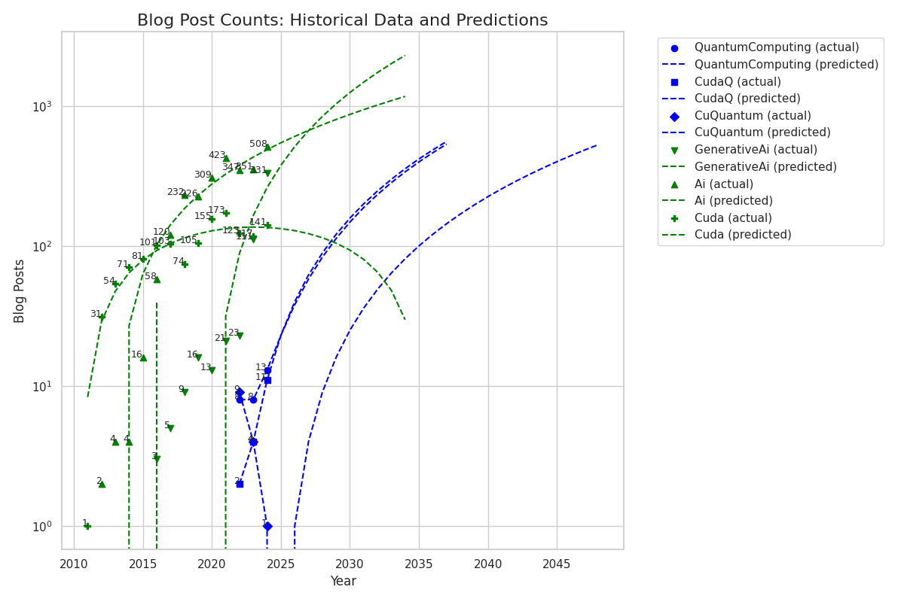

# quantumStatus
Identifying where in the Hype cycle we are, using Nvidia BlogPosts as guidance

## Analysis Results

### Blog Post Counts Overview

### Detailed Post Counts Table
You can find the detailed table of blog post counts and forecasts in the following files:
- CSV: [blog_post_counts_table.csv](output/blog_post_counts_table.csv)
- Markdown: [blog_post_counts_table.md](output/blog_post_counts_table.md)

## Generalizations
- **AI vs Quantum**: AI blog posts significantly outpace Quantum Computing posts, indicating a higher level of investment and focus in AI-related research and development at Nvidia.
- **Growth Trends**: AI shows consistent growth, while Quantum Computing has sporadic increases, suggesting emerging interest but less established traction.
- **Forecasts**: Quantum Computing is projected to grow to meet AI's 2024 post count, aligning with potential increases in investment and market focus.

## Issues with Data Analysis
- **Data Source**: The analysis is based solely on the number of blog posts tagged with specific keywords on Nvidia's website. This may not accurately reflect the overall investment or growth in each field.
- **Market Monopoly**: Nvidia does not have a monopoly in Quantum Computing as it does in AI, potentially leading to fewer exclusive blog posts.
- **Historical Data**: Nvidia's website began in 2011, limiting the historical data available for analysis.
- **Marketing Influence**: The number of blog posts may be influenced by the size and focus of Nvidia's marketing department, rather than direct investment or technological advancement.

